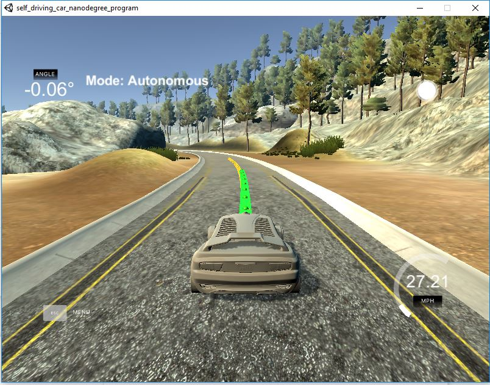

# CarND-Controls-MPC
## Self-Driving Car Engineer Nanodegree Program

---
### Objective: Develop an MPC controller that adjusts the actuation parameters of steering angle and throttle to drive a simulated vehicle around a track. The input driven into the controller is a path that is coincident with the centre of the track. 


### The Model
---
The MPC controller receives continuous inputs from the simulation. At each input step the simulation provides, in global map coordinates, the x and y points of the centre path, the current x and y position, the angular direction of the car, and the speed of the vehicle.

These coordinates are re-interpreted every time data is received so that the waypoint path is in reference from the origin of the car. These coordinates of the centre path which are given in coordinates from the car origin are run through a function that determines the coefficients of the third order polynomial that they approximate. The output of the third order polynomial at 0 is the cross track error at the current position of the car and the arc tan of the second coefficient is the difference in car heading. At this stage all the information necessary for the initial state is collected. 

The components of our state are: [x-position, y-position, car heading, velocity, cross-track error, and heading angle difference]

The initial state is set as: [0, 0, 0, v, cte, epsi]

The initial state and the coefficients of the waypoint polynomial are inputted as arguments in the MPC solver function. The MPC solver function determines the optimal values for our actuation (steering angle, and throttle) for every time step in a specified number of time steps so that the projected trajectory from its current position to the final time step approximates the waypoint coordinates as close as possible. 

The components of our actuation are: [steering angle (delta) , throttle (a)]

The update equations to predict consecutive states for the specified number of time steps are the following:
- px(t+1) = px(t) + v(t) * cos(psi(t)) * dt
- py(t+1) = py(t) + v(t) * sin(psi(t)) * dt
- psi(t+1) = psi(t) + v(t) / Lf * deltaPsi * dt
- v(t+1) = v(t) + a * dt;

dt is the time between consecutive states and Lf is the distance between the front axle to the center of gravity which is responsible for determining turning radius. 

### Timestep Length and Elapsed Duration (N and dt)
---
The final timestep length was 0.1 seconds with an elapsed duration of 10 timesteps. This was the suggested timestep length and duration provided by Udacity during the project walkthrough. Changing these values was found to be extremely consequential as it would result in frenetic behaviour. Values that were tried include 15/0.05, and 8/0.25.

### Polynomial Fitting and MPC Preprocessing 
---
The general MPC preprocessing steps are described above in the model section. In the image below a view of the projected polynomial fitted to the waypoints is shown.



### Model Predictive Control with Latency
---
The whole purpose of applying actuation to a system is to influence the the system's future states, specifically the next possible future state whereby an acutation can be applied again to its following state. However the latency inherent in the system causes a delay of the actuation effect of 100 milliseconds which is the same length as a time step. Therefore in the update equations on line 97 of MPC.cpp the actuation values for time steps after the second time step is reset to two time steps before so that the other state values can be calculated based on the effect of the actual corresponding actuation input. 


## Dependencies

* cmake >= 3.5
 * All OSes: [click here for installation instructions](https://cmake.org/install/)
* make >= 4.1(mac, linux), 3.81(Windows)
  * Linux: make is installed by default on most Linux distros
  * Mac: [install Xcode command line tools to get make](https://developer.apple.com/xcode/features/)
  * Windows: [Click here for installation instructions](http://gnuwin32.sourceforge.net/packages/make.htm)
* gcc/g++ >= 5.4
  * Linux: gcc / g++ is installed by default on most Linux distros
  * Mac: same deal as make - [install Xcode command line tools]((https://developer.apple.com/xcode/features/)
  * Windows: recommend using [MinGW](http://www.mingw.org/)
* [uWebSockets](https://github.com/uWebSockets/uWebSockets)
  * Run either `install-mac.sh` or `install-ubuntu.sh`.
  * If you install from source, checkout to commit `e94b6e1`, i.e.
    ```
    git clone https://github.com/uWebSockets/uWebSockets
    cd uWebSockets
    git checkout e94b6e1
    ```
    Some function signatures have changed in v0.14.x. See [this PR](https://github.com/udacity/CarND-MPC-Project/pull/3) for more details.

* **Ipopt and CppAD:** Please refer to [this document](https://github.com/udacity/CarND-MPC-Project/blob/master/install_Ipopt_CppAD.md) for installation instructions.
* [Eigen](http://eigen.tuxfamily.org/index.php?title=Main_Page). This is already part of the repo so you shouldn't have to worry about it.
* Simulator. You can download these from the [releases tab](https://github.com/udacity/self-driving-car-sim/releases).
* Not a dependency but read the [DATA.md](./DATA.md) for a description of the data sent back from the simulator.


## Basic Build Instructions

1. Clone this repo.
2. Make a build directory: `mkdir build && cd build`
3. Compile: `cmake .. && make`
4. Run it: `./mpc`.

## Tips

1. It's recommended to test the MPC on basic examples to see if your implementation behaves as desired. One possible example
is the vehicle starting offset of a straight line (reference). If the MPC implementation is correct, after some number of timesteps
(not too many) it should find and track the reference line.
2. The `lake_track_waypoints.csv` file has the waypoints of the lake track. You could use this to fit polynomials and points and see of how well your model tracks curve. NOTE: This file might be not completely in sync with the simulator so your solution should NOT depend on it.
3. For visualization this C++ [matplotlib wrapper](https://github.com/lava/matplotlib-cpp) could be helpful.)
4.  Tips for setting up your environment are available [here](https://classroom.udacity.com/nanodegrees/nd013/parts/40f38239-66b6-46ec-ae68-03afd8a601c8/modules/0949fca6-b379-42af-a919-ee50aa304e6a/lessons/f758c44c-5e40-4e01-93b5-1a82aa4e044f/concepts/23d376c7-0195-4276-bdf0-e02f1f3c665d)
5. **VM Latency:** Some students have reported differences in behavior using VM's ostensibly a result of latency.  Please let us know if issues arise as a result of a VM environment.

## Editor Settings

We've purposefully kept editor configuration files out of this repo in order to
keep it as simple and environment agnostic as possible. However, we recommend
using the following settings:

* indent using spaces
* set tab width to 2 spaces (keeps the matrices in source code aligned)

## Code Style

Please (do your best to) stick to [Google's C++ style guide](https://google.github.io/styleguide/cppguide.html).

## Project Instructions and Rubric

Note: regardless of the changes you make, your project must be buildable using
cmake and make!

More information is only accessible by people who are already enrolled in Term 2
of CarND. If you are enrolled, see [the project page](https://classroom.udacity.com/nanodegrees/nd013/parts/40f38239-66b6-46ec-ae68-03afd8a601c8/modules/f1820894-8322-4bb3-81aa-b26b3c6dcbaf/lessons/b1ff3be0-c904-438e-aad3-2b5379f0e0c3/concepts/1a2255a0-e23c-44cf-8d41-39b8a3c8264a)
for instructions and the project rubric.

## Hints!

* You don't have to follow this directory structure, but if you do, your work
  will span all of the .cpp files here. Keep an eye out for TODOs.

## Call for IDE Profiles Pull Requests

Help your fellow students!

We decided to create Makefiles with cmake to keep this project as platform
agnostic as possible. Similarly, we omitted IDE profiles in order to we ensure
that students don't feel pressured to use one IDE or another.

However! I'd love to help people get up and running with their IDEs of choice.
If you've created a profile for an IDE that you think other students would
appreciate, we'd love to have you add the requisite profile files and
instructions to ide_profiles/. For example if you wanted to add a VS Code
profile, you'd add:

* /ide_profiles/vscode/.vscode
* /ide_profiles/vscode/README.md

The README should explain what the profile does, how to take advantage of it,
and how to install it.

Frankly, I've never been involved in a project with multiple IDE profiles
before. I believe the best way to handle this would be to keep them out of the
repo root to avoid clutter. My expectation is that most profiles will include
instructions to copy files to a new location to get picked up by the IDE, but
that's just a guess.

One last note here: regardless of the IDE used, every submitted project must
still be compilable with cmake and make./

## How to write a README
A well written README file can enhance your project and portfolio.  Develop your abilities to create professional README files by completing [this free course](https://www.udacity.com/course/writing-readmes--ud777).
